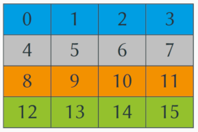

# Parallelisierungsschema
### Teilaufgabe 1: Beschreibung der Datenaufteilung der Matrix auf die einzelnen Tasks.
- Welche Daten der Matrix werden von welchem Task verwaltet?
    + die Daten werden zeilenweise auf die Tasks aufgeteilt, so dass z.B. Zeile 0..(Größe der Matrix)/(Anzahl der Tasks) dem ersten Task zugeteilt wird
- Visualisieren Sie die Datenaufteilung mit geeigneten Grafiken.
    
---
### Teilaufgabe 2: Parallelisierungsschema für das Jacobi-Verfahren.
- Beschreiben Sie aus Sicht eines Tasks, wann die Berechnung und wann die Kommunikation mit seinen Nachbarn erfolgt. Unterscheiden Sie nach gemeinsamem und verteiltem Speicher.
    + Die Berechnung kann zunächst ohne Kommunikation losgehen, jedoch sollten sich Tasks nicht in unterschiedlichen Iterationsschritten befinden, also müssen die Tasks nach jeder Iteration signalisieren, dass sie für die Nächste bereit sind. Die Berechnung wird dann fortgesetzt, wenn alle Tasks bereit sind. Wie ein Task seine Bereitschaft signalisiert, hängt von dem zugrundeliegendem Speichermodell ab.
- Welche Daten benötigt der Task von seinen Nachbarn und wann tauscht er die Daten aus?
    + Der Task benötigt die angrenzenden Daten unter- und oberhalb seines Bereiches, bei gemeinsamem Speicher kann er direkt auf diesen Zugreifen, da die Ergebnisse ja in einer separaten Matrix gespeichert werden. Bei verteiltem Speicher muss unser Task seinen benachbarten Task um die relevanten Daten bitten. Dies kann jederzeit innerhalb der jetzigen Iteration erfolgen, da nur die jeweils andere Matrix beschrieben wird.
- Auf welche Variablen bzw. Daten muss welcher Task zugreifen?
    + Jeder Task greift auf seine lokalen Variablen (i, fpisin_i, j, star, residuum), zahlreiche globale runtime Konstanten (z.B. options->inf_func), die Variable maxresiduum unter gegenseitigem Ausschluss sowie seinen zugewiesenen Bereich der Matrix zu.
---
### Teilaufgabe 3: Parallelisierungsschema für das Gauß-Seidel-Verfahren.
- Beschreiben Sie aus Sicht eines Tasks, wann die Berechnung und wann die Kommunikation mit seinen Nachbarn erfolgt. Unterscheiden Sie nach gemeinsamem und verteiltem Speicher.
    + Die Berechnung darf hier nicht einfach losgehen, da an andere Tasks angrenzende Daten von diesen Tasks benötigt werden könnte. So sollten entweder die relevanten Daten an die anderen Tasks geschickt werden, oder auf ein Signal gewartet werden, dass die Daten nicht mehr benötigt werden.
- Welche Daten benötigt der Task von seinen Nachbarn und wann tauscht er die Daten aus?
    + Hier werden wieder die angrenzenden Daten benötigt, allerdings müssen sie jetzt angefordert/gelesen werden, bevor sie vom Nachbarn überschrieben werden.
- Auf welche Variablen bzw. Daten muss welcher Task zugreifen?
    + siehe Jacobi
---
### Teilaufgabe 4: Diskussion der Abbruchproblematik
- Es sind vier Fälle zu betrachten: Abbruch nach Iterationszahl und Genauigkeit für jeweils Jacobi und Gauß-Seidel.
- Wann wird ein Task feststellen, dass das Abbruchkriterium erreicht wurde und er seine Arbeit beenden kann?
    + Abbruch nach Iterationszahl:
      + Die Iterationen werden auf die verschiedenen Threads gleichmäßig verteilt (Iterationen/Threadanzahl). Das Programm terminiert, sobald jeder Thread seine zugewiesene Anzahl Iterationen abgearbeitet hat.
    + Abbruch nach Genauigkeit:
      + Die Threads teilen sich die 'residuum'-Variable und terminieren, sobald dieser Restfehler unter einem bestimmten Threshold liegt.
- In welcher Iteration beendet sich ein Task im Vergleich zu seinen Nachbarn, wenn er das Abbruchkriterium erreicht?
    + Da die Nachbartasks des terminierenden Tasks von den von ihm berechneten Werten abhängen, müssen diese angrenzenden Tasks eine Iteration weiter rechnen, um die finalen Werte des terminierten Tasks noch in die Berechnung einzubinden.
---
### Zusatz
In `partdiff` wurde kein Speicher freigegeben, wenn der Aufruf von malloc fehlschlug. Dies wurde mit Hilfe eines Vektors, welcher alle zugewiesenen Pointer speichert, behoben. Dies funktioniert allerdings nur so lange, bis irgendwo manuell Speicher (re)allokiert oder freigegeben wird.
