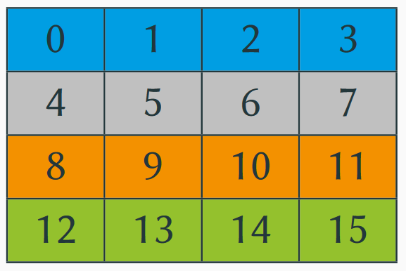

# Parallelisierungsschema
### Teilaufgabe 1: Beschreibung der Datenaufteilung der Matrix auf die einzelnen Tasks.
- Welche Daten der Matrix werden von welchem Task verwaltet?
    + <TODO...>

- Visualisieren Sie die Datenaufteilung mit geeigneten Grafiken.
    
    

---
### Teilaufgabe 2: Parallelisierungsschema für das Jacobi-Verfahren.
- Beschreiben Sie aus Sicht eines Tasks, wann die Berechnung und wann die Kommunikation mit seinen Nachbarn erfolgt. Unterscheiden Sie nach gemeinsamem und verteiltem Speicher.
    + <TODO...>

- Welche Daten benötigt der Task von seinen Nachbarn und wann tauscht er die Daten aus?
    + <TODO...>

- Auf welche Variablen bzw. Daten muss welcher Task zugreifen?
    + <TODO...>

---
### Teilaufgabe 3: Parallelisierungsschema für das Gauß-Seidel-Verfahren.
- Beschreiben Sie aus Sicht eines Tasks, wann die Berechnung und wann die Kommunikation mit seinen Nachbarn erfolgt. Unterscheiden Sie nach gemeinsamem und verteiltem Speicher.
    + <TODO...>

- Welche Daten benötigt der Task von seinen Nachbarn und wann tauscht er die Daten aus?
    + <TODO...>

- Auf welche Variablen bzw. Daten muss welcher Task zugreifen?
    + <TODO...>

---
### Teilaufgabe 4: Diskussion der Abbruchproblematik
- Es sind vier Fälle zu betrachten: Abbruch nach Iterationszahl und Genauigkeit für jeweils Jacobi und Gauß-Seidel.
    + <TODO...>

- Wann wird ein Task feststellen, dass das Abbruchkriterium erreicht wurde und er seine Arbeit beenden kann?
    + <TODO...>

- In welcher Iteration beendet sich ein Task im Vergleich zu seinen Nachbarn, wenn er das Abbruchkriterium erreicht?
    + <TODO...>

---
