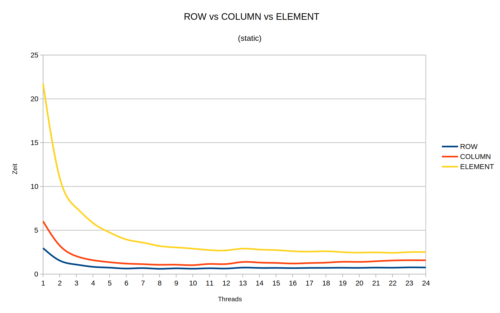
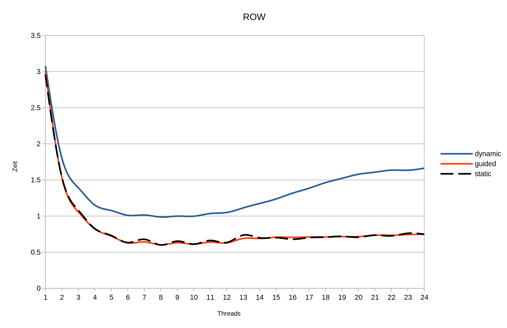
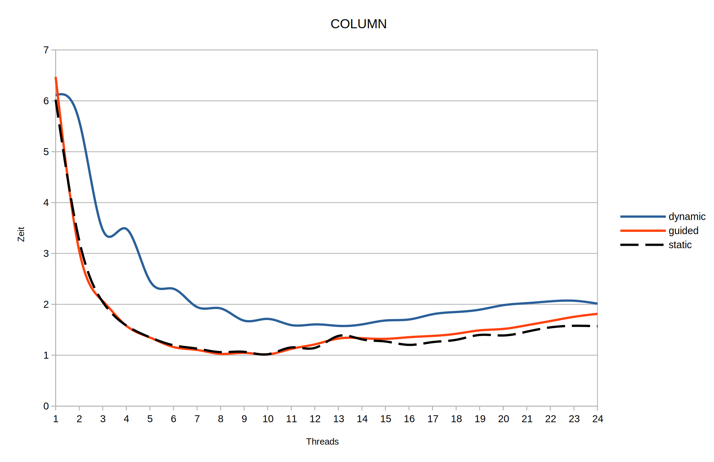
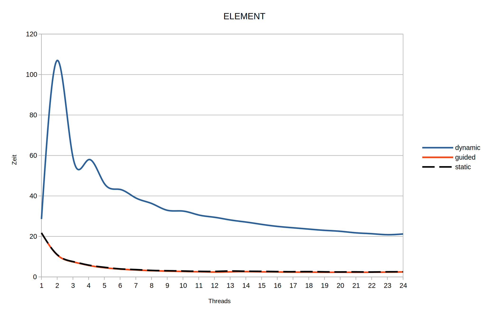

# Leistungsanalyse
### Messung 1: Vergleich der Laufzeiten (4096 Interlines)
- Datenaufteilungen: zeilen-, spalten- und elementweise Aufteilung (static scheduling, da so am schnellsten)
    
    + Zeilenweise (blau) [top mit 6 Threads, ~0.8s]
      - bei einem Thread läuft das Programm ca. 3s
      - zwei Threads halbieren die Laufzeit (~1.5s), 4 Threads brauchen ca. 1s
      - ab 6 Threads ist keine nennenswerte Leistungsverbesserung zu erkennen (~0.8s)
    + Spaltenweise (orange) [top mit 8 Threads, ~1-1.2s]
      - bei einem Thread läuft das Programm ca. 6 Sekunden
      - zwei Threads halbieren die Laufzeit (~3s), 4 Threads benötigen ~2s
      - die Laufzeit ist mit ca. 8 Threads am geringsten (~1.2s)
      - mit weiter steigender Threadanzahl bis 24 Threads steigt die Laufzeit auf ~2s wieder an
    + Elementweise (gelb) [top mit 12 Threads, ~3s]
      - diese Datenaufteilung ist von den gemessenen mit Abstand die Langsamste: ein Thread benötigt bis zu 22s
      - zwei Threads halbieren die Laufzeit (~11s), 4 Treads laufen ~6s
      - die Laufzeit verbessert sich mit einer Anzahl von 12 Threads auf ~3s
      - mehr Threads verbessern die Laufzeit jedoch nicht
- Scheduling-Algorithmen: Zeilenweise
  
  + Dynamic (blau) [top mit 6-10 Threads, ~1s]
    - 1 Thread braucht mit dynamic scheduling ~3s
    - Dynamic scheduling ist mit 6-10 Threads am schnellsten (~1s)
    - bei 11 Threads und mehr steigt die Laufzeit an (~1.65s für 24 Threads)
  + Guided (orange) [top mit 8, 10 oder 12 Threads, ~0.6s]
    - 1 Thread braucht mit guided scheduling ~3s
    - 2 Threads brauchen ca. 1.5s (halbiert)
    - am schnellsten mit 8, 10 oder 12 Threads (\~0.6s): eine ungerade Threadanzahl braucht minimal mehr Zeit (\~+0.05s)
    - guided scheduling ist mit 13 oder mehr Threads wieder langsamer (~0.7s)
  + Static (gestrichelt) [top mit 8, 10 oder 12 Threads, ~0.6s]
    - siehe guided scheduling (nahezu identisch, keine nennenswerten Abweichungen)
- Scheduling-Algorithmen: Spaltenweise
  
  + Dynamic (blau) [top mit 12 Threads, ~1.6s]
    - 1 Thread braucht mit dynamic scheduling ~6.1s
    - bei 2 Threads mit ~5.9s Laufzeit nur mäßig schneller, außerdem mit 3 Threads schneller als mit 4
    - beste Laufzeit mit 12 Threads (~1.6s)
    - bei 24 Threads steigt die Laufzeit auf ~2s
  + Guided (orange) [top mit 10 Threads, ~1s]
    - 1 Thread braucht mit guided scheduling ~6.2s
    - 2 Threads doppelt so schnell, 4 Threads 4x so schnell
    - beste Laufzeit mit 8-10 Threads, ~1s
    - mehr mehr Threads linear mehr Zeit (24 Threads ~1.9s)
  + Static (gestrichelt) [top mit 10 Threads, ~1s]
    - siehe guided scheduling (nahezu identisch)
    - bei 24 Threads ist static scheduling leicht schneller als guided: ~1.6s (~0.3s schneller)
- Scheduling-Algorithmen: Elementweise
  
  + Dynamic (blau) [top mit 23-24 Threads, ~21s]
    - langsamstes Scheduling-Verfahren
    - 1 Threads braucht ca. 28s, 2 Threads brauchen allerdings ~106s
    - 3 Threads sind ~6s schneller als 4 Threads (~58s)
    - von 5 bis 24 Threads verringert sich die Laufzeit immer weiter auf ~21s
  + Guided (orange) [top mit 8-24 Threads, ~2-3s]
    - 1 Thread benötigt ~21s
    - 2 Threads sind ca. doppelt so schnell (~11s)
    - beste Laufzeit ab ~8 Threads (~3s), stagniert bis 24 Threads
  + Static (gestrichelt)
    - siehe guided scheduling (nahezu identisch, keine nennenswerten Abweichungen)
- Auswertung
  + Zeilenweise läuft die Parallelisierung am schnellsten ab (die benötigten Daten liegen im Speicher nah bei einander und es gibt weniger Seitenfehler als bei der spaltenweisen Aufteilung)
  + Spaltenweise ist das Programm ~50% langsamer (Daten sind über den Speicher verteilt --> längere Zugriffszeit)
  + Elementweise läuft mit 3 Sekunden mehr als 3x so lang wie zeilenweise Datenaufteilung
  + Dynamic scheduling ist immer die langsamste Methode
    - Zeilenweise/Spaltenweise dauert es mit wachsender Threadanzahl immer länger
    - lediglich die elementweise Aufteilung profitiert bei wachsender Threadanzahl vom Dynamic-Scheduling und wird immer schneller
  + Guided/Static scheduling von den Laufzeiten ist nahezu identisch
    - bei geringer Threadzahl halbiert sich die Laufzeit bei doppelter Threadanzahl
    - ab ~8 Threads erreicht die Laufzeit ihr Minimum
    - bei zeilenweiser/elementweiser Datenaufteilung stagniert die Laufzeit mit wachsender Treadanzahl
    - bei spaltenweiser Datenaufteilung steigt die Laufzeit mit wachsender Threadzahl leicht an
---
### Messung 2

---
