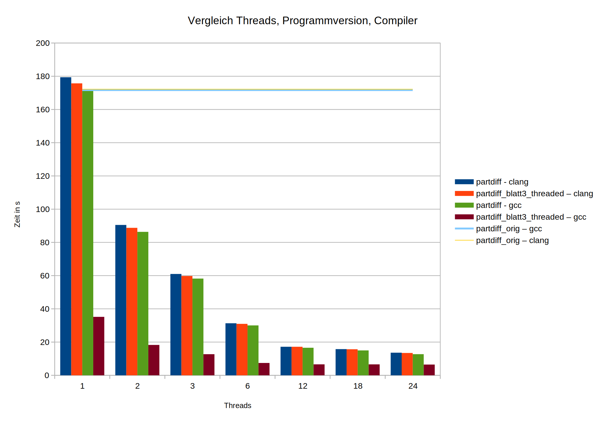
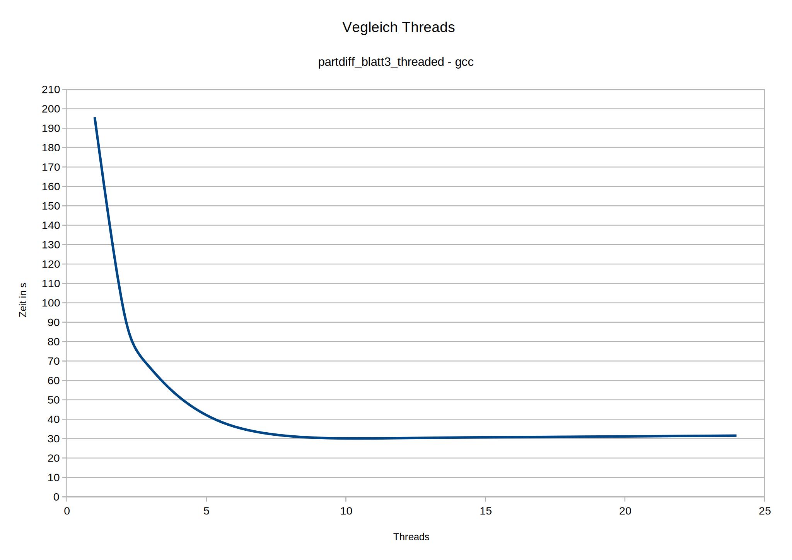

# Parallelisierung mit POSIX Threads
Wir haben mehrere Versionen von `partdiff` parallelisiert. Die Version in `partdiff.c` basiert zum Teil auf denen mit OpenMP parallelisierten der vorherigen Blätter. In `partdiff_blatt3_threaded.c` wurde die innere Schleife unserer optimierten Variante von Blatt 3, welche interessante Perfomancecharakteristiken aufwies, in `partdiff.c` eingefügt.

Die Arbeitszeit, um zu einem lauffähigen Programm zu kommen, lag bei ungefähr sechs Stunden, plus zwei Stunden Bug-Jagd und -fixing.

# Leistungsanalyse
## Ausgangsvergleich mehrerer Versionen
Wir hatten mehrere Versionen des Programmes geschrieben und wollten zunächst herausfinden, welche die schnellste ist. Zusätzlich sollten noch Clang und gcc miteinander verglichen werden. Alle Benchmarks wurden mit 4096 Interlines und 19 Iterationen auf `ant14` ausgeführt.
- Säulendiagamm:
  

Fast alle Versionen des Programmes verhalten sich ähnlich, so dass ihr Speedup mit zunehmender Threadanzahl langsamer wächst. Nur die Variante `partdiff_blatt3_threaded` erreicht einen besonders großen Speedup mit dem gcc-Compiler, allerdings wächst dieser auch zunehmend langsamer mit der Threadanzahl.

## Laufzeiten abhängig von Threadanzahl (4096 Interlines)
Im Nachfolgenden wird die Laufzeit der `partdiff_blatt3_threaded`-Variante mit dem gcc-Compiler anhand der Threadanzahl verglichen. Hier wurden jetzt 109 Iterationen verwendet, um auf die Mindestlaufzeit von 30s zu kommen. Da sich bei der Erhöhung der Iterationen der parallele Anteil des Programms erhöht, läuft das Programm pro Iteration schneller. Hier wurde `ant15` verwendet, welche allerdings die gleiche Hardwarekonfiguration hat wie `ant14`.
- Säulendiagramm:
  
- Liniendiagramm:
  
- Auswertung:
  + ~1-6 Threads: bei kleiner Threadanzahl halbiert sich die Ausführungszeit bei Verdopplung der Threadanzahl noch nahezu
  + ~6-10 Threads: Speedup nimmt deutlich ab
  + ~10+ Threads: keine nennenswerte Geschwindigkeitsverbesserung bzw. sogar Verschlechterung
## Hardwarekonfiguration
- Geben Sie die für die Messungen verwendete Hardwarekonfiguration (Prozessor, Anzahl der Kerne, Größe des Arbeitsspeichers etc.) an
### Ant14
```
% lscpu
Architektur:                   x86_64
CPU Operationsmodus:           32-bit, 64-bit
Byte-Reihenfolge:              Little Endian
CPU(s):                        48
Liste der Online-CPU(s):       0-47
Thread(s) pro Kern:            2
Kern(e) pro Socket:            24
Sockel:                        1
NUMA-Knoten:                   1
Anbieterkennung:               AuthenticAMD
Prozessorfamilie:              25
Modell:                        1
Modellname:                    AMD EPYC 7443 24-Core Processor
Stepping:                      1
CPU MHz:                       2850.000
Maximale Taktfrequenz der CPU: 4035,6440
Minimale Taktfrequenz der CPU: 1500,0000
BogoMIPS:                      5700.03
Virtualisierung:               AMD-V
L1d Cache:                     32K
L1i Cache:                     32K
L2 Cache:                      512K
L3 Cache:                      32768K
NUMA-Knoten0 CPU(s):           0-47
Markierungen:                  fpu vme de pse tsc msr pae mce cx8 apic sep mtrr pge mca cmov pat pse36 clflush mmx fxsr sse sse2 ht syscall nx mmxext fxsr_opt pdpe1gb rdtscp lm constant_tsc rep_good nopl nonstop_tsc cpuid extd_apicid aperfmperf pni pclmulqdq monitor ssse3 fma cx16 pcid sse4_1 sse4_2 movbe popcnt aes xsave avx f16c rdrand lahf_lm cmp_legacy svm extapic cr8_legacy abm sse4a misalignsse 3dnowprefetch osvw ibs skinit wdt tce topoext perfctr_core perfctr_nb bpext perfctr_llc mwaitx cpb cat_l3 cdp_l3 invpcid_single hw_pstate ssbd mba ibrs ibpb stibp vmmcall fsgsbase bmi1 avx2 smep bmi2 erms invpcid cqm rdt_a rdseed adx smap clflushopt clwb sha_ni xsaveopt xsavec xgetbv1 xsaves cqm_llc cqm_occup_llc cqm_mbm_total cqm_mbm_local clzero irperf xsaveerptr wbnoinvd amd_ppin arat npt lbrv svm_lock nrip_save tsc_scale vmcb_clean flushbyasid decodeassists pausefilter pfthreshold v_vmsave_vmload vgif v_spec_ctrl umip pku ospke vaes vpclmulqdq rdpid overflow_recov succor smca fsrm sme sev sev_es
```

```
% free -h
              total        used        free      shared  buff/cache   available
Mem:          125Gi        17Gi       106Gi        41Mi       1,2Gi       106Gi
Swap:         4,0Gi          0B       4,0Gi
```

### Ant15
```
% lscpu
Architektur:                   x86_64
CPU Operationsmodus:           32-bit, 64-bit
Byte-Reihenfolge:              Little Endian
CPU(s):                        48
Liste der Online-CPU(s):       0-47
Thread(s) pro Kern:            2
Kern(e) pro Socket:            24
Sockel:                        1
NUMA-Knoten:                   1
Anbieterkennung:               AuthenticAMD
Prozessorfamilie:              25
Modell:                        1
Modellname:                    AMD EPYC 7443 24-Core Processor
Stepping:                      1
CPU MHz:                       2850.000
Maximale Taktfrequenz der CPU: 4035,6440
Minimale Taktfrequenz der CPU: 1500,0000
BogoMIPS:                      5700.02
Virtualisierung:               AMD-V
L1d Cache:                     32K
L1i Cache:                     32K
L2 Cache:                      512K
L3 Cache:                      32768K
NUMA-Knoten0 CPU(s):           0-47
Markierungen:                  fpu vme de pse tsc msr pae mce cx8 apic sep mtrr pge mca cmov pat pse36 clflush mmx fxsr sse sse2 ht syscall nx mmxext fxsr_opt pdpe1gb rdtscp lm constant_tsc rep_good nopl nonstop_tsc cpuid extd_apicid aperfmperf pni pclmulqdq monitor ssse3 fma cx16 pcid sse4_1 sse4_2 movbe popcnt aes xsave avx f16c rdrand lahf_lm cmp_legacy svm extapic cr8_legacy abm sse4a misalignsse 3dnowprefetch osvw ibs skinit wdt tce topoext perfctr_core perfctr_nb bpext perfctr_llc mwaitx cpb cat_l3 cdp_l3 invpcid_single hw_pstate ssbd mba ibrs ibpb stibp vmmcall fsgsbase bmi1 avx2 smep bmi2 erms invpcid cqm rdt_a rdseed adx smap clflushopt clwb sha_ni xsaveopt xsavec xgetbv1 xsaves cqm_llc cqm_occup_llc cqm_mbm_total cqm_mbm_local clzero irperf xsaveerptr wbnoinvd amd_ppin arat npt lbrv svm_lock nrip_save tsc_scale vmcb_clean flushbyasid decodeassists pausefilter pfthreshold v_vmsave_vmload vgif v_spec_ctrl umip pku ospke vaes vpclmulqdq rdpid overflow_recov succor smca fsrm sme sev sev_es
```

```
% free -h
              total        used        free      shared  buff/cache   available
Mem:          125Gi        17Gi       106Gi        41Mi       1,7Gi       106Gi
Swap:         4,0Gi          0B       4,0Gi
```
