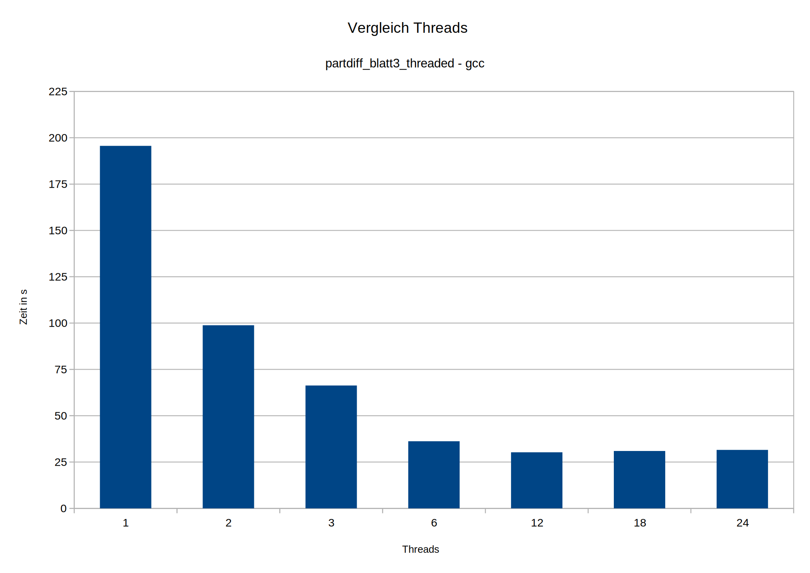

# Leistungsanalyse
### Laufzeiten abhängig von Threadanzahl (4096 Interlines)
- Vergleich Laufzeiten bei 1, 2, 3, 6, 12, 18, 24
- Auswertung
  + ~1-6 Threads: bei kleiner Threadanzahl halbiert sich die Ausführungszeit bei Verdopplung der Threadanzahl noch nahezu
  + ~6-10 Threads: Speedup nimmt deutlich ab
  + ~10+ Threads: keine nennenswerte Geschwindigkeitsverbesserung
  
  
### Vergleich mit ursprünglichen seriellen Variante
- Vergleich Threads, Programmversion (partdiff, partdiff_blatt3_threaded, partdiff_orig), Compiler (clang/gcc)
- Auswertung:
  + gcc-blatt3-threaded-Version mit Abstand am schnellsten
  
### Hardwarekonfiguration
- Geben Sie die für die Messungen verwendete Hardwarekonfiguration (Prozessor, Anzahl der Kerne, Größe des Arbeitsspeichers etc.) an
- Prozessor: <TODO>
- Anzahl der Kerne: <TODO>
- Größe des Arbeitsspeichers: <TODO>
- etc. <TODO>
